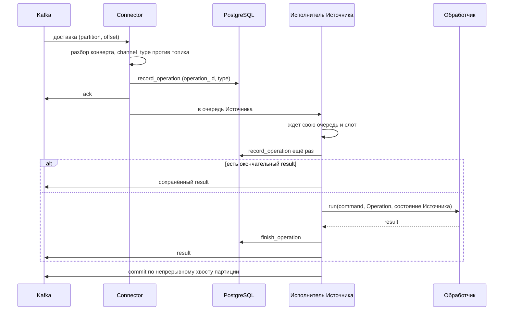
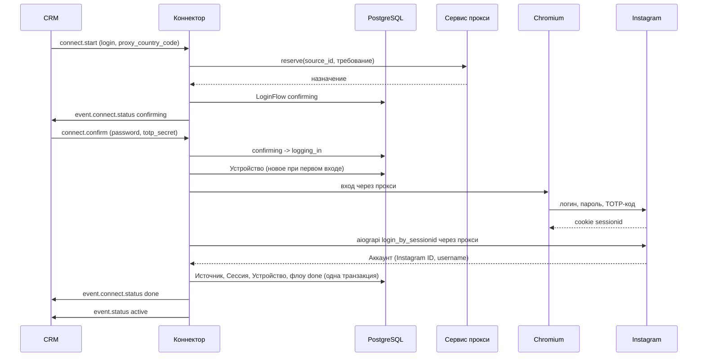
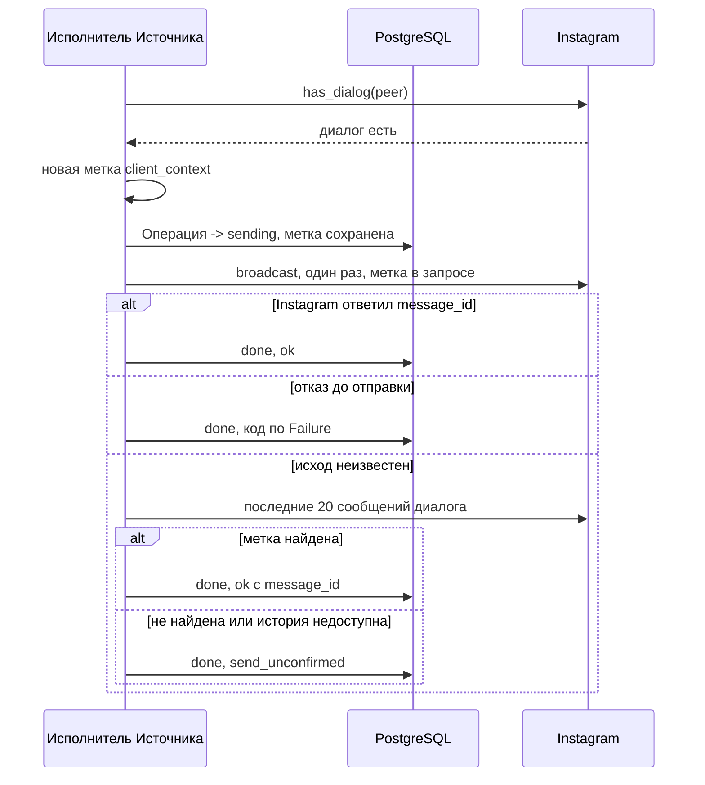

# Архитектура ig-connector

Как устроен коннектор внутри: модули и их порты, путь команды от Kafka до `result`, вход,
отправка, входящие, статусы, прокси, хранение и тесты. Протокол описан в
[kafka-contract-2.1.md](kafka-contract-2.1.md), здесь только то, как код его исполняет.

## Словарь

| Слово | Что это в коде |
|---|---|
| **Источник** | `source_id` контракта; `store.Source`. Канал в CRM, к которому привязан один Аккаунт |
| **Аккаунт** | аккаунт Instagram (`instagram.Account`: Instagram ID и username). Один Аккаунт принадлежит не больше чем одному работающему Источнику |
| **Сессия** | залогиненное состояние aiograpi (`SessionData`, это `get_settings()` в JSON). В памяти живая, в базе зашифрованная |
| **Устройство** | профиль браузера + настройки устройства aiograpi (`Device`). Создаётся один раз на Источник, переиспользуется при каждом входе |
| **Флоу входа** | `connect.start` + `connect.confirm` с одним `operation_id`; `store.LoginFlow` |
| **Операция** | команда CRM с её сохранённым исходом, ключ `(operation_id, type)`; `store.Operation` |

## Модули и порты

Ядро (`runtime/`) знает только порты. Реализации подставляются в `app.py`
(`platform_wiring`), в тестах вместо них фейки.

```text
src/ig_connector/
  contract/   модели контракта 2.1 (pydantic), codec: разбор команд, reply_to, build_event
  bus/        порт Bus; KafkaBus (aiokafka)
  store/      порт Store; PostgresStore (asyncpg) и SQL-миграции
  instagram/  порт Platform + InboundSource и типы платформы
    adapter/  AiograpiPlatform: aiograpi 2.0.15, перевод ошибок в Failure
    weblogin/ WebLogin: вход через Chromium (Playwright) -> sessionid -> aiograpi
  proxy/      порт ProxyProvider; ProxyService (HTTP), StaticProxy, NoProxies
  runtime/    ядро: Connector, обработчики, LoginFlows, InboundPolling, Statuses,
              SessionRestore, ProxyLifecycle, WatchedPlatform
  app.py      сборка из env, запуск, остановка, healthcheck
```

### Шина (`bus/`)

`Bus` — три операции: `deliveries()` (записи топика команд по порядку партиций, начиная
после закоммиченного offset), `publish(event)` (в топик событий с ключом `source_id`,
возвращается, когда брокер принял) и `commit(delivery)`. `KafkaBus`: SASL SCRAM-SHA-256,
группа `connector.<channel_type>`, автокоммит выключен, продюсер с идемпотентностью и
`acks=all`. Потеря партиций (ребаланс, истёкшая сессия консьюмера) завершает поток, а с ним
и процесс: записи в полёте пришли бы снова в той же сессии и сломали бы учёт offset'ов.
Перезапуск делает супервизор (docker `restart: unless-stopped`).

### Хранилище (`store/`)

`Store` хранит всё, что должно пережить рестарт: Операции, Флоу входа, Источники с
последним опубликованным статусом, Сессии и Устройства, позиции во входящих. Реализация
одна, `PostgresStore`; миграции из `store/migrations/` применяются при старте. Подробнее в
«Хранение и шифрование».

### Instagram (`instagram/`)

Порт `Platform` — всё, что коннектор делает с Instagram: `login`, `logout`, `restore`
(поднять сохранённую Сессию без входа), `disconnect`, `check` (один настоящий запрос
`accounts/current_user/`), `has_dialog`, `send_text`, `recent_messages`,
`user_by_username`, `user_by_id`. Порт `InboundSource` — `new_messages` (новые сообщения
основного инбокса после сохранённых позиций). Все вызовы, кроме `login`, адресуются по
`source_id`: адаптер держит живой aiograpi `Client` каждого Источника.

Отказ платформы всегда приходит как `PlatformError` с `Failure` из закрытого списка:
`bad_credentials`, `session_revoked`, `challenge`, `flood`, `rate_limited`, `rejected`,
`not_found`, `network` (сбой соединения до того, как что-то дошло до Instagram),
`no_answer` (чтение без ответа, прокси не доказанно виноват), `unknown_after_send` (отправка
могла уйти). Перевод исключений aiograpi в `Failure` — только на границе адаптера
(`adapter/errors.py`), отдельно для чтений и для отправки. Детали ошибки содержат имя
типа исключения, никогда его текст: тексты aiograpi цитируют запросы с Сессией.

`AiograpiPlatform` работает на `ConnectorClient` (наследник aiograpi `Client`):

- подставляет нашу метку `client_context` в отправляемое сообщение;
- шлёт `direct_v2/threads/broadcast/` один раз, на отдельном соединении, без редиректов и
  без повторов: aiograpi сам повторяет запрос после 408 или обрыва, httpx идёт за 307 с тем
  же POST, curl переотправляет запрос на умершем соединении из пула. Для сообщения любое из
  этого — второе сообщение получателю;
- никогда не ходит без прокси (пустой прокси aiograpi понимает как «напрямую»).

Инбокс и треды читаются сырыми запросами aiograpi (`direct_v2/inbox/`,
`direct_v2/threads/<id>/`) с `visual_message_return_type=unseen`, разбор свой
(`adapter/direct.py`): экстракторы aiograpi обрезают время сообщения до секунд в локальной
зоне и роняют страницу целиком на незнакомом элементе.

`WebLogin` (`weblogin/`): безголовый Chromium через прокси Источника открывает веб-вход
Instagram, вводит логин, пароль и TOTP-код (генерируется из секрета), страницы
распознаются по URL и тексту (`pages.recognise`). Cookie `sessionid` уходит в aiograpi
`login_by_sessionid` через тот же прокси, это и есть Сессия. Браузер живёт только на время
попытки. Профиль браузера после входа (без cookie сессии) сохраняется в Устройство.

### Прокси (`proxy/`)

`ProxyProvider`: `reserve(source_id, requirement)` (идемпотентно: тот же `source_id` = то
же назначение), `heartbeat`, `connection_failed`, `rebalance`, `release`. Реализации:
`ProxyService` (HTTP-клиент сервиса прокси, только эндпоинты `/v1/assignments`,
`account_id` = `source_id`), `StaticProxy` (один прокси из конфига на всех, для стенда),
`NoProxies` (прокси не настроены: любой `reserve` отказывает). Отказ — `ProxyUnavailable`;
`AssignmentLost`, если назначение уже не принадлежит Источнику.

### Ядро (`runtime/`)

| Модуль | Что делает |
|---|---|
| `connector.py` | `Connector`: читает доставки, раскладывает по очередям Источников, исполнитель на Источник, ack, дедуп, ответ, коммит |
| `handlers.py` | реестр обработчиков по типу команды; `edit`/`delete` отказывают сразу |
| `send.py`, `resolve.py` | `command.send`, `command.resolve_recipient` |
| `login.py` | `LoginFlows`: Флоу входа |
| `inbound.py` | `InboundPolling`: опрос входящих одного Источника |
| `statuses.py` | `Statuses`: публикует `event.status`, знает состояние Источника для ядра |
| `watched.py` | `WatchedPlatform`: обёртка над платформой, каждый ответ двигает статус |
| `refusals.py` | что значит `Failure` для команды (код `result`) и для Источника (статус) |
| `restore.py` | `SessionRestore`: поднять Сессию после рестарта и перепроверить Источник в ошибке |
| `proxying.py` | `ProxyLifecycle`: heartbeat, переезд, переключение при сбое |
| `slots.py` | общий лимит одновременных обращений к Instagram, команды вперёд |
| `offsets.py` | коммит offset'ов по непрерывному хвосту каждой партиции |

Обработчики и опрос получают `WatchedPlatform`, а `SessionRestore` и `ProxyLifecycle` —
голый адаптер: они сами решают, что сообщить.

## Жизненный цикл команды



1. **Приём.** `Connector.run` читает доставки по порядку. Нечитаемый конверт или
   `channel_type`, не совпадающий с топиком (§4), — в лог, команда не исполняется, offset
   коммитится.
2. **Операция сохранена → ack.** `record_operation` вставляет `(operation_id, type)`, если
   такой ещё нет, и в любом случае возвращает сохранённую. Сразу после — `ack`, ещё до
   очереди Источника. Ключ из пары, а не из `operation_id`: `connect.start` и
   `connect.confirm` делят один `operation_id`. База недоступна — ack не шлётся (ack
   значит «сохранено»), исполнитель попробует сохранить ещё раз в свою очередь и при отказе
   ответит `source_offline`.
3. **Очередь Источника.** У каждого Источника своя очередь в памяти и своя задача-исполнитель:
   команды одного Источника идут строго по одной и по порядку, разные Источники параллельно.
   Очередь — только порядок уже прочитанных доставок, не очередь повторов: своих ретраев нет,
   повторяет CRM по коду ошибки.
4. **Слот.** Одновременно к Instagram обращаются не больше `MAX_PARALLEL_SOURCES`
   Источников (команды, опрос, восстановление, смена прокси). Освободившийся слот получает
   сначала ждущая команда: у неё идёт таймер CRM, у опроса нет.
5. **Дедуп.** Если у Операции уже есть окончательный `result`, он отправляется как есть,
   действие не повторяется. Исключение — коды, которые CRM повторяет (`network_error`,
   `peer_flood`, `source_offline`, `rate_limited`): новая доставка с таким исходом —
   это повтор CRM, и он получает новую попытку.
6. **Проверка Источника.** Обработчику, которому нужен работающий Аккаунт, неактивный
   Источник отвечает сразу: выключен (`disabled`) → `channel_rejected`, ограничен
   Instagram → `peer_flood`, нет Сессии или сети → `source_offline`. Операция, найденная в
   состоянии `sending`, идёт в обработчик в любом случае: её сообщение могло уйти, и
   повторяемый код дал бы дубль.
7. **Обработчик** получает команду, Операцию, состояние Источника и момент, с которого CRM
   считает свой таймаут (первый ack). Исключение обработчика → `internal_error` с именем
   типа, без текста (в тексте может быть сообщение или секрет).
8. **Ответ.** `finish_operation` сохраняет исход, затем публикуется `result` с
   `source_id`, `operation_id`, `channel_type`, `contract_version` из команды
   (`codec.reply_to`). Если сохранить не удалось, `result` всё равно уходит: исход
   настоящий.
9. **Коммит.** Источники идут параллельно, поэтому поздняя запись партиции может
   закончиться раньше ранней. `PartitionOffsets` коммитит партицию только до непрерывного
   хвоста законченных записей.

`connect.start` и `connect.confirm` идут тем же путём, но без ack и result (§6.7): каждый
шаг отвечает `event.connect.status`, и шаг закончен, когда его состояние сохранено и
событие опубликовано.

Таймеры CRM считаются от первого ack:

| Команда | CRM ждёт | Коннектор |
|---|---|---|
| `resolve_recipient` | 10 с | поиск укладывается в 8 с от приёма, время в очереди входит |
| `send` | 300 с | ответ за 290 с: проверка диалога до 30 с, отправка до 210 с, сверка до 20 с; меньше 10 с на отправку — не начинать (`network_error`, ничего не ушло) |
| `connect.*` | 5 мин на флоу | вход до 240 с и не позже чем за 15 с до конца флоу |

## Флоу входа



- **connect.start.** Логин берётся из `login`, иначе из `phone`, а при переподключении
  (`reconnect_source_id` = `source_id`) — из последнего успешного входа.
  `proxy_country_code: null` («напрямую» по контракту) → `failed` + `source_offline`:
  напрямую не ходим. Нет прокси (409, сервис недоступен) → `failed` + `source_offline`.
- **connect.confirm.** Флоу переводится `confirming → logging_in` условным апдейтом:
  повторная доставка того же confirm второй вход не начнёт. Найден флоу в `logging_in`
  (процесс упал посреди входа) → `failed` «login interrupted»: одна попытка на confirm,
  решение о новой за CRM. Найден `done` → тот же `done` ещё раз (первый мог потеряться
  вместе с процессом).
- **Устройство** создаётся и сохраняется до первой попытки, чтобы неудачная попытка и
  следующая выглядели для Instagram одним телефоном.
- **Пароль и TOTP-секрет** живут только в исполняемой команде: в `LoginFlow`, в базе и в
  логах их нет.
- **Отказы:** неверный пароль или код → `verify_failed`; проверка, которую коннектор не
  проходит (SMS, почта, чекпоинт, капча, 2FA без секрета) → `connect_failed` с подсказкой;
  флуд → `peer_flood`; сеть или нет ответа → `source_offline`; прочее → `connect_failed`.
  Тексты в `error_text` фиксированные, деталь адаптера — только в лог.
- **Один Аккаунт — один Источник.** Аккаунт уже у другого работающего Источника →
  `connect_failed`, новая Сессия разлогинивается. Если прежний Источник мёртв
  (`needs_reconnect`, или `error` без живой Сессии в этом процессе), Аккаунт переезжает в
  той же транзакции: прежний Источник выключается и получает `event.status disabled`.
  Вход в другой Аккаунт, чем тот, что у переподключаемого Источника, → `connect_failed`.
- **После `done`** — `event.status active`: Сессия только что ответила.

## Отправка (`command.send`)



- Только текст и только в существующий личный диалог основного инбокса. Вложения →
  `channel_rejected` без обращения к Instagram; диалога нет → `channel_rejected`.
- **Метка до вызова.** Перед отправкой Операция переходит в `sending` с нашей меткой
  `client_context` (19 цифр, как у приложений Instagram). С этого момента сообщение могло
  уйти, и ни один исход не отвечает кодом, который CRM повторит.
- **Что значит отказ.** `network`, `rate_limited`, `flood` для отправки говорятся, только
  когда сообщение точно не ушло: Instagram ответил 4xx или отказом в теле, или соединение
  не дошло до записи запроса (DNS, TCP, рукопожатие прокси, TLS). Всё остальное после
  начала вызова — `unknown_after_send`: таймаут, обрыв, 5xx, нечитаемый ответ, исключение
  адаптера.
- **Сверка.** Неизвестный исход ищется в последних 20 сообщениях диалога по метке. Нашли
  → `ok: true` с `external_message_id`. Не нашли, история недоступна, Источник не активен
  или время вышло → `send_unconfirmed` (терминальный, CRM не повторит). Слепой второй
  отправки не бывает.
- **Повторная доставка** Операции в `sending` (процесс упал посреди отправки) не
  отправляет, а сразу сверяет по сохранённой метке.
- `delivered` в `result` не заполняется: Instagram не сообщает доставку в Direct.
  `reply_to_external_id` принимается, но сообщение уходит без цитаты.

## Поиск получателя (`command.resolve_recipient`)

Только чтение, получатель ничего не видит. `username` → `user_info_by_username_v1`,
`external_id` (число) → `user_info_v1`. `external_chat_id` в ответе = Instagram ID: личный
диалог адресуется Instagram ID собеседника. `phone` → `recipient_not_found`: личный
аккаунт не ищет людей по телефону. Не укладывается в 8 с от приёма → `network_error`.

## Входящие

- **Где.** Опрос идёт в исполнителе Источника, раз в `INBOUND_POLL_INTERVAL` (по умолчанию
  30 с, интервал от начала опроса), с разбросом первого опроса, чтобы Источники не
  опрашивались в такт. Никогда одновременно с командой того же Источника: пришедшая
  команда прерывает опрос (CRM ждёт `resolve_recipient` всего 10 с), опрос повторяется
  сразу после неё. Опрос не дольше 30 с.
- **Что.** До 5 страниц инбокса по 20 тредов, пока у самого старого треда страницы есть
  новое; в каждом треде до 5 страниц назад до сохранённой позиции. Только основной
  инбокс: запросы на переписку (pending) пропускаются, группы тоже. Свои сообщения
  Аккаунта (из приложения или наши) не публикуются. Ничего не отмечается прочитанным.
- **Позиции.** На каждый тред — последнее обработанное сообщение (`message_id` и время в
  Instagram с микросекундами). Тред без позиции читается от момента подключения
  Источника (`since`): истории до подключения в CRM нет.
- **Порядок «сначала опубликовать, потом сдвинуть».** Сообщение публикуется, затем позиция
  треда сдвигается на него. Падение или прерывание между этими шагами опубликует его ещё
  раз тем же событием: `operation_id` события детерминирован (uuid5 от `source_id` и id
  сообщения), CRM дедуплицирует. Потерь нет. Пропущенные сообщения (группы, свои) тоже
  сдвигают позицию.
- **Событие.** `external_chat_id` = `external_user_id` = Instagram ID собеседника; id треда
  наружу не выходит. `occurred_at` = время сообщения в Instagram. Текст и ссылка →
  `kind: text`, остальное → `kind: unsupported` с пустым текстом. `reply_to_external_id` —
  id сообщения, на которое ответили.

## Статусы

`Statuses` — единственное место, откуда уходит `event.status`.

- **Только при смене.** Статус публикуется, если отличается от последнего опубликованного,
  затем сохраняется у Источника. Падение между публикацией и сохранением опубликует его
  ещё раз после рестарта, но никогда не оставит CRM без него.
- **`active` только по факту.** В памяти процесса отдельно хранится, для каких Источников
  этот процесс сам видел живую Сессию (вход или проверка после рестарта). Сохранённый
  `active` от прошлого процесса ничего не значит: при старте `active` не рассылается, его
  даёт успешная проверка.
- **Каждый ответ платформы двигает статус** (`WatchedPlatform`): отказ, который говорит
  что-то об Аккаунте, переводит его в статус, успешный ответ возвращает из `error` в
  `active`.

| Отказ Instagram | `event.status` | Команда в этот момент |
|---|---|---|
| `session_revoked`, `bad_credentials`, `challenge` | `needs_reconnect` + `deauthorized` | `source_offline` |
| `flood` | `error` + `peer_flood` | `peer_flood` |
| `network`, нет прокси | `error` + `source_offline` | `network_error` / `source_offline` |
| `rate_limited`, `rejected`, `not_found`, `no_answer` | без изменений | `rate_limited`, `channel_rejected`, `recipient_not_found`, `network_error` |

- **Возврат.** Источник в `error` перепроверяется на такте опроса входящих (`SessionRestore.
  recheck`): поднять Сессию, если её нет, и один запрос `check`. Ответил → `active`.
  `peer_flood` перепроверяется не чаще раза в 15 минут: ограничения Instagram длятся часами,
  а чтение может работать, когда отправка нет. `needs_reconnect` не перепроверяется: его
  заканчивает только новый вход.
- **`disabled`** — Источник, чей Аккаунт переехал в новый Источник. Выключенный Источник
  не поднимается, его статусы больше не публикуются, команды → `channel_rejected`.

## Рестарт и остановка

- **Старт.** Миграции, Kafka, затем для каждого подключённого и не выключенного Источника
  запускается исполнитель, который первым делом поднимает его Сессию (`SessionRestore`):
  резерв прокси (тот же, резерв идемпотентен), Сессия из базы в aiograpi через прокси,
  проверочный запрос. Ответ → `active` (если это смена), отказ → его статус. Команды
  Источника ждут в очереди, пока Сессия не поднята, и не получают ложного
  `source_offline`.
- **Повторные доставки.** Всё, что не закоммичено, придёт снова. Законченная Операция
  отвечается из базы, Операция в `sending` сверяется по метке, флоу в `logging_in`
  заканчивается `failed`.
- **Остановка (SIGTERM).** Новые доставки и команды не берутся, текущим даётся 8 с
  (`DRAIN_GRACE`, меньше 10 с `docker stop`). Что не успело — не закоммичено и придёт после
  рестарта. Смена прокси, начатая до остановки, доводится как команда: полупереехавшая
  Сессия хуже поздней остановки. Второй сигнал остановку не ломает.
- **Падение части.** Конец потока доставок (потеря партиций) или упавшая фоновая задача
  роняют процесс; поднимает его супервизор.

## Прокси

`ProxyLifecycle` — тот `ProxyProvider`, которым пользуются вход и восстановление. Он
помнит каждое выданное назначение и раз в 60 с шлёт по нему heartbeat с состоянием
транспорта (`connected`, если у процесса есть живая Сессия, иначе `unknown`; `draining` /
`closed` во время переезда).

Всё, что меняет прокси Источника, исполняется в исполнителе этого Источника между его
командами, никогда параллельно с командой:

- **Плановый переезд** (`pending_rebalance` в ответе heartbeat): транспорт закрывается
  (`disconnect`), сервису уходит heartbeat `closed` и подтверждение переезда с `job_id`,
  Сессия поднимается на новом прокси.
- **Подтверждённый сетевой сбой** (адаптер ответил `network`): `connection-failed`, затем
  Сессия на следующем прокси, который даст сервис. Не чаще раза в интервал heartbeat: у
  статического прокси следующий будет тем же.
- **Назначение потеряно** (сервис его больше не знает): Сессия на новом.
- **Брошенное назначение** (Флоу входа закончился без Источника, Источник выключен)
  освобождается через 5 минут после резерва.

Капча, бан, флуд и отзыв Сессии прокси не меняют: смена адреса у ограниченного аккаунта
провоцирует блокировку. Нет прокси (409, сервис недоступен) — Источник в `error` +
`source_offline`, в сеть не ходит. Сервис недоступен во время переезда — Источник остаётся
на прежнем прокси.

## Хранение и шифрование

| Таблица | Что | Ключ |
|---|---|---|
| `operations` | Операции: состояние (`received` / `sending` / `done`), `result`, метка `client_context` | `(operation_id, type)` |
| `login_flows` | Флоу входа: состояние, логин, требование к прокси, срок | `operation_id` |
| `sources` | Источник: Аккаунт, требование к прокси, последний статус, логин, `disabled_at` | `source_id`; уникален `(channel_type, external_account_id)` среди не выключенных |
| `sessions` | Сессия и Устройство подключённого Источника, зашифрованы | `source_id` |
| `devices` | Устройство до первого успешного входа, зашифровано | `source_id` |
| `inbox_starts`, `inbox_positions` | момент подключения и позиция на тред | `source_id`, `(source_id, thread_id)` |

- Сессии и Устройства шифруются Fernet ключом `SESSION_ENCRYPTION_KEY`: дамп базы Аккаунты
  не отдаёт. Неверный ключ останавливает старт до всего остального.
- Не хранятся нигде: пароль, TOTP-секрет, коды, тексты сообщений (в Операции только
  исход, в `result` текста нет).
- В логах нет текстов переписки и секретов. Поля с текстом (`text`, `caption`, ...)
  логируются только длиной (`logs.py`), исключения — типом. Модели держат секреты в
  `SecretStr`; `masking.py` вторым рубежом маскирует поля с секретными именами (пароль,
  токен, `sessionid`, cookie, URL прокси и базы), креды внутри URL и заголовки
  авторизации в любом тексте. Логи aiograpi и httpx заглушены: они пишут URL запросов,
  ответы Instagram и тексты.

## Тесты

| Набор | Что проверяет | Что настоящее |
|---|---|---|
| `tests/contract/` | модели против каждого JSON-примера документа контракта и правил контракта | модели |
| `tests/behaviour/` | поведение коннектора целиком | `Connector` со всем ядром, `PostgresStore` |
| `tests/adapter/` | `AiograpiPlatform`: отправка, сверка, инбокс, ошибки | aiograpi `Client`, подменён только HTTP-транспорт (`support/instagram_api.py`) |
| `tests/weblogin/` | вход через браузер | Chromium, страницы отдаёт подставной HTTP-прокси (`support/instagram_web.py`) |
| `tests/test_proxy_http.py` | клиент сервиса прокси | HTTP, сервис подставной по его openapi (`support/proxy_server.py`) |
| `tests/integration/` | доступ к Kafka, S3, PostgreSQL стенда, обмен команда/ответ, сервис | стенд шины, `-m integration` |

**Шов поведенческих тестов** — коннектор целиком (`support/connector.py`,
`running_connector`): тест кладёт команды CRM в шину в памяти (`MemoryBus`) и проверяет,
что вышло в топик событий и что закоммичено. Время — `FakeClock`: таймауты в 300 с
проходят мгновенно и детерминированно. Instagram — `FakeInstagram` со сценариями (отказ,
зависание, «отправил и упал»), сервис прокси — `FakeProxyService`. Рестарт = новый
коннектор над той же схемой базы и той же шиной. Каждый тест получает свою схему
PostgreSQL.

**Трассы.** Каждый поведенческий тест пишет в `.test-runs/<запуск>/<тест>/` `trace.jsonl`
(всё, что прошло через шину, фейки и логи, с временем фейковых часов) и `summary.md`
(одна строка на шаг). Всё проходит через тот же маскировщик, что и логи сервиса. Хранятся
последние 10 запусков; каталог меняется переменной `IG_TEST_RUNS_DIR`.
